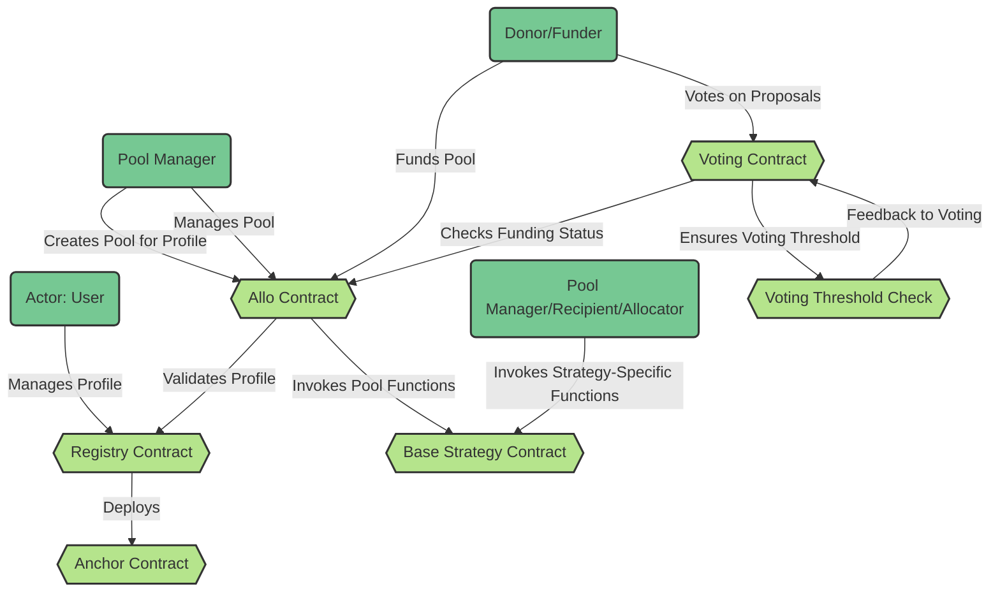
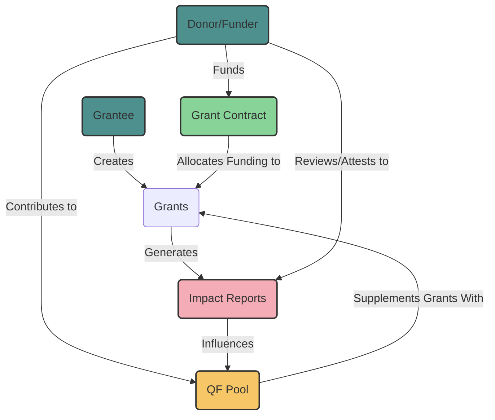

# Imps - Built with Scaffold-ETH 2

🧪 Built using Scaffold-Eth-2; an open-source up-to-date toolkit for building decentralized applications (dapps) on the Ethereum blockchain. It's designed to make it easier for developers to create and deploy smart contracts and build user interfaces that interact with those contracts.

- ✅ **Contract Hot Reload**: Your frontend auto-adapts to your smart contract as you edit it.
- 🪝 **[Custom hooks](https://docs.scaffoldeth.io/hooks/)**: Collection of React hooks wrapper around [wagmi](https://wagmi.sh/) to simplify interactions with smart contracts with typescript autocompletion.
- 🧱 [**Components**](https://docs.scaffoldeth.io/components/): Collection of common web3 components to quickly build your frontend.
- 🔥 **Burner Wallet & Local Faucet**: Quickly test your application with a burner wallet and local faucet.
- 🔐 **Integration with Wallet Providers**: Connect to different wallet providers and interact with the Ethereum network.

# Abstract

Poor social health, poverty, lack of social programs and overall coordination lie at the roots of our inability to healthily progress as a species. Giving citizens more political power and insights on the inner mechanics of their social systems is now more possible than ever.
In our pursuit of enhancing community engagement we must carefully consider the operating systems and models underpinning our communities and organizations. 
These systems, which have evolved over thousands of years, remain central to our collective existence yet the opaque and arcane nature of many of these systems often undermines trust and inhibits meaningful community interaction. 
This opacity and lack of coordination can discourage engagement, and make it difficult and inefficient to operate. With today’s technology we have the power to mitigate many of the social issues described above, even litigatory behavior amongst HOAs and Homeowners, Non-profits, and more. To generate more trust, participation, and symbiosis within our underlying social infrastructures,we must focus on the development of our political infrastructures, underlying governance models, and approaches on bridging the two. 

## Requirements

Before you begin, you need to install the following tools:

- [Node (>= v18.17)](https://nodejs.org/en/download/)
- Yarn ([v1](https://classic.yarnpkg.com/en/docs/install/) or [v2+](https://yarnpkg.com/getting-started/install))
- [Git](https://git-scm.com/downloads)
1. Clone this repo & install dependencies

```
git clone https://github.com/scaffold-eth/scaffold-eth-2.git
cd scaffold-eth-2
yarn install
```

2. Run a local network in the first terminal:

```
yarn chain
```

This command starts a local Ethereum network using Hardhat. The network runs on your local machine and can be used for testing and development. You can customize the network configuration in `hardhat.config.ts`.

3. On a second terminal, deploy the test contract:

```
yarn deploy
```

This command deploys a test smart contract to the local network. The contract is located in `packages/hardhat/contracts` and can be modified to suit your needs. The `yarn deploy` command uses the deploy script located in `packages/hardhat/deploy` to deploy the contract to the network. You can also customize the deploy script.

4. On a third terminal, start your NextJS app:

```
yarn start
```

Visit your app on: `http://localhost:3000`. You can interact with your smart contract using the `Debug Contracts` page. You can tweak the app config in `packages/nextjs/scaffold.config.ts`.

Run smart contract test with `yarn hardhat:test`

- Edit your smart contract `YourContract.sol` in `packages/hardhat/contracts`
- Edit your frontend in `packages/nextjs/pages`
- Edit your deployment scripts in `packages/hardhat/deploy`

## Supported Networks

| Network         | Chain ID |
| --------------- | -------- |
| Mainnet         | 1        |
| Goerli          | 5        |
| Sepolia         | 11155111 |
| Base            | 8453     |
| Base Goerli     | 84531    |
| Optimism        | 10       |
| Optimism Goerli | 420      |
| Celo            | 42220    |
| Celo Alfajores  | 44787    |
| Arbitrum        | 42161    |
| Arbitrum Sepolia| 421614   |


⚙️ Built using NextJS, RainbowKit, Hardhat, Wagmi, Viem, AlloV2, EAS, ERC1155 Hypercerts and more. 

## AlloV2

### Registry Contract (`Registry.sol`)

The `Registry` contract serves as the foundational building block of the Allo Protocol. It facilitates the creation, attestation, and management of profiles. A profile is a unique entity representing a user's identity within the protocol. This contract offers functions to query profiles by ID and anchor, as well as to create new profiles with personalized metadata, attestation addresses, and members.

Each time a profile generates a new anchor (during profile creation or when profile name is updated), it triggers the deployment of an Anchor Contract. These Anchor Contracts serve as versatile tools that can receive funds or fulfill other designated purposes. This dynamic mechanism enables profiles to engage in a wide array of activities within the protocol, enhancing flexibility and functionality across the Allo ecosystem.


### Anchor Contract (`Anchor.sol`)

The `Anchor` contract is a vital component that enhances the capabilities of profiles. It acts as an isolated enclave, allowing profile owners to securely interact with external addresses. Profile owners can execute calls to target addresses while maintaining control over the amount of native tokens sent and the data transmitted. This contract leverages the `Registry` contract for verifying ownership, ensuring that only authorized users can utilize its functionality.

### Allo Contract (`Allo.sol`)

At the heart of the Allo Protocol lies the `Allo` contract, a versatile and feature-rich smart contract that enables efficient and decentralized fund allocation and distribution. The contract encompasses mechanisms for handling fees, managing treasury, and defining access controls. Its comprehensive design is composed of distinct functions, variables, modifiers, and events that collaboratively enable a robust fund management framework.

"The Allo Protocol is a technologically advanced framework for decentralized fund allocation and distribution. By employing the `Registry`, `Anchor`, and `Allo` contracts in tandem, the protocol establishes an ecosystem where users can securely manage their funds, define strategies, and participate in a DeFi ecosystem that embodies transparency and user-centric governance."




# Objective 

Our goal is to close the transparency and accountability gaps in traditional public goods funding mechanisms. This will make funding more efficient and strengthen the bond between funders, donors, grantees, and their communities, fostering a sense of ownership, community, and purpose. We believe that this innovative approach can help increase public good funding and support important causes. We would like to provide tooling and resouces for enhanced governance within capital allocation and impact reporting. 
With these enhanced and capitally effecient methods we hope to provide more capital bandwith and effeciency to non-profits, HOAs, taxation systems, DAOs, Public Goods and Retro PG funding, and whatever more is to come.

# How 

This can be accomplished by integrating systems where grantees can link tangible proof of their work directly to their grants through hypercert technology, verifiable through EAS. With this data we can begin to give donors the power to evaluate and vote on the effectiveness fund utilization. If a grant receives negative feedback from a significant portion of its supporters, SQF and batch based funding can be halted, encouraging grantees to maintain some level of transparency and community engagement. This democratized oversight mechanism not only pressures grantees to be more open but also empowers more individuals to confidently invest in their communities, leading to broader participation in funding initiatives that have a real impact. 

Within AlloV2 Custom strategies, we can alter the flow of streamline or batch-based Quadratic Funding. Donors and funders can seperately review the impact reports within the grants they have contributed to, and weight their votes on how impactful they feel the project currently is. These voted weights can have negative affects on the grantees share of the QF pool, urging them to provide more impactful reports, or to reach out to funders or donors to address their attestation and attempt a resolve. 

By integrating the Scaffold-Eth-2 SDK we can allow any project or community to create their own custom funding strategy, questions, weights, and more. Abstracting the process of implementing custom strategies and deploying custom rounds with enhanced governance mechanisms will be an ever lasting journey. Below is a visualization of the reviewment process using a custom alloV2 protocol.

# Overall Interaction

1. Users create profiles in the `Registry` contract and associate their addresses with specific roles and permissions.
2. Users, identified by their addresses and associated profiles, interact with the `Allo` contract to create pools, allocate funds, and manage pools.
3. The `Allo` contract checks user profiles with the `Registry` to ensure that only authorized users perform certain actions.
4. Strategies (inherited from `BaseStrategy`) within the `Allo` contract handle allocation, distribution, and management of funds based on specific logic.
5. The `Anchor` contract allows for dynamic execution of arbitrary calls based on predefined conditions, often triggered by events in the `Allo` ecosystem.
6. Together, these contracts create an ecosystem where users can manage and allocate funds according to various strategies while adhering to predefined permissions and conditions.



# About us 

Our team consists of experienced developers and experts in the Political and DeFi space. With shared history in working with non-profits and tracking federal grants funding allocated to under resourced communities, we are passionate about using technology for social good. We believe that IMPs has the potential to fill in the larger remaining gaps in public goods funding incetives within local communities. 

## Contributing to Scaffold-ETH 2

We welcome contributions to IMPs! Create a branch and request to push your updates!
